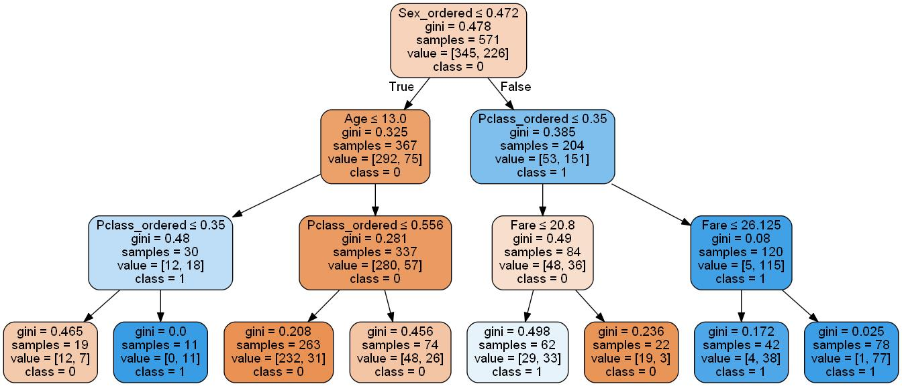

# Rule_Extraction_From_Trees

### Introduction

This project is based on Scikit-learn's official repo ( [Skope-rules](https://github.com/scikit-learn-contrib/skope-rules) ), which aims at extracting comprehensible rules from most tree-based algorithms, and then selecting the best performing rule set for making prediction. Currently only supports 2-classes classification task.

 Major groups of functionalities:
(1) Visualize tree structures and output into images;
(2) Rule extraction from trained tree models; 
(3) Filter rules based on recall/precision threshold on a given dataset.

Model supported:
(1) DecisionTreeClassifier/DecisionTreeRegressor
(2) BaggingClassifier/BaggingRegressor
(3) RandomForestClassifier/RandomForestRegressor
(4) ExtraTreesClassifier/ ExtraTreeRegressor


本项目基于 Scikit-learn 的官方项目 ( [Skope-rules](https://github.com/scikit-learn-contrib/skope-rules) ) 改编，旨在从基于决策树模型中提取可理解的规则，并在此基础上筛选出最优质的规则集合用于预测。目前支持二分类任务。

主要功能：
(1) 将决策树的结构可视化，输出成图片
(2) 从训练好的模型中抽取规则
(3) 根据在给定数据集上的 recall/precision 表现对规则筛选

支持模型：
(1) 单颗决策树
(2) BaggingClassifier/BaggingRegressor
(3) RandomForestClassifier/RandomForestRegressor
(4) ExtraTreesClassifier/ ExtraTreeRegressor


### Quick Start

See **Demo1** [here](https://github.com/13918078239/Rule_Extraction_from_Trees/blob/master/Demo1_Rule_Extraction_from_Trees.ipynb) for a detailed usage example.

First download the code into your project folder.

1. Train or load a tree-based model. Having the dataset that is trained on is better.

```
import pandas as pd
import numpy as np
from sklearn.model_selection import train_test_split
from sklearn import tree,ensemble,metrics

from rule import Rule
from rule_extraction import rule_extract,draw_tree

# Suppose you have loaded your training dataset
model = tree.DecisionTreeClassifier(criterion='gini',max_depth=3)
model.fit(X_train,y_train)
```

2. Extract all the rules from the tree (all paths from root node to leaves)

```python
rule_extract(model=model,feature_names=X_train.columns)
['Sex_ordered > 0.4722778797149658 and Pclass_ordered <= 0.3504907488822937 and Fare <= 20.799999237060547',
 'Sex_ordered > 0.4722778797149658 and Pclass_ordered > 0.3504907488822937 and Fare > 26.125',
 'Sex_ordered > 0.4722778797149658 and Pclass_ordered > 0.3504907488822937 and Fare <= 26.125',
 'Sex_ordered <= 0.4722778797149658 and Age <= 13.0 and Pclass_ordered > 0.3504907488822937',
 'Sex_ordered > 0.4722778797149658 and Pclass_ordered <= 0.3504907488822937 and Fare > 20.799999237060547',
 'Sex_ordered <= 0.4722778797149658 and Age <= 13.0 and Pclass_ordered <= 0.3504907488822937',
 'Sex_ordered <= 0.4722778797149658 and Age > 13.0 and Pclass_ordered <= 0.556456983089447',
 'Sex_ordered <= 0.4722778797149658 and Age > 13.0 and Pclass_ordered > 0.556456983089447']
```

3. Draw the structure of the tree

```python
draw_tree(model=model,
          outdir='./images/DecisionTree/',
          feature_names=X_train.columns,
          proportion=False, # show [proportion] or [number of samples] from a node
          class_names=['0','1'])
```





4. Filter rules base on recall/precision on dataset

```python
rule_extract(model=model_tree_clf,
            feature_names=X_train.columns,
             x_test=X_test,
             y_test=y_test,
             recall_min_c1=0.1,  # recall threshold on class 1
             precision_min_c1=0.5)  # precision threshold on class 1
# return:(rule, recall on 1-class, prec on 1-class, recall on 0-class, prec on 0-class, nb) 
[('Fare > 26.125 and Pclass_ordered > 0.3504907488822937 and Sex_ordered > 0.4722778797149658',
  (0.328125, 0.9130434782608695, 0.9746835443037974, 0.6311475409836066, 1)),
 ('Fare <= 26.125 and Pclass_ordered > 0.3504907488822937 and Sex_ordered > 0.4722778797149658',
  (0.21875, 0.875, 0.9746835443037974, 0.5968992248062015, 1)),
 ('Fare <= 20.799999237060547 and Pclass_ordered <= 0.3504907488822937 and Sex_ordered > 0.4722778797149658',
  (0.171875, 0.6470588235294118, 0.9240506329113924, 0.553030303030303, 1))]
```


### API Reference

TODO


Dependencies
------------

This project requires:

- Python (>= 2.7 or >= 3.3)
- NumPy (>= 1.10.4)
- SciPy (>= 0.17.0)
- Pandas (>= 0.18.1)
- Scikit-Learn (>= 0.17.1)

- pydotplus (>=2.0.2)